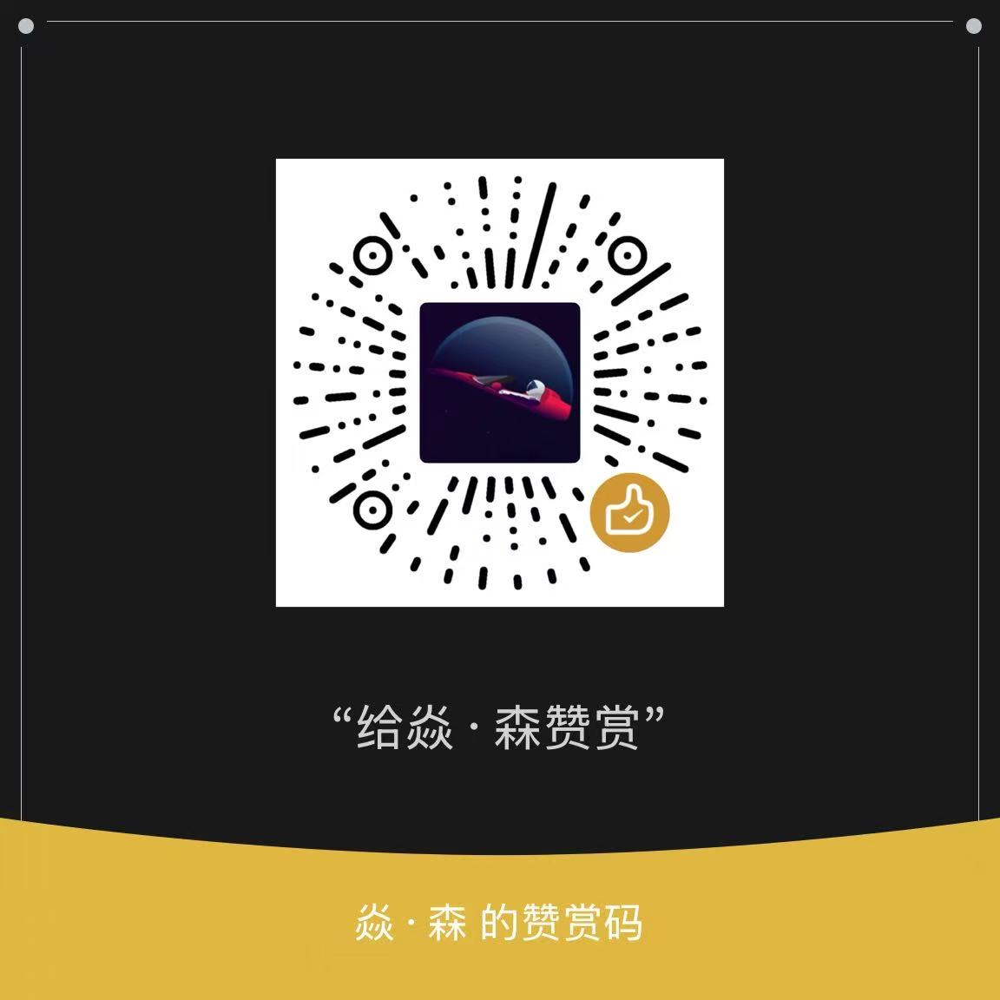

# AI Chat Exporter (AI 对话导出助手)

<div align="center">

[](https://chromewebstore.google.com/detail/ai-chat-exporter/eplnkdnnbmmijjadnabdefmjnjgapigm)
[](https://microsoftedge.microsoft.com/addons/detail/ai-chat-exporter/kjhchmmjjffhhgaoocijicockllaoaah)
[](LICENSE)

**一键导出 AI 对话记录，完美保留格式与上下文**

[English README](README_EN.md) | [中文文档](README.md)

</div>

## 📖 简介

**AI Chat Exporter** 是一款强大的浏览器扩展，专为保存和归档 AI 对话而设计。它能够将您与 AI 的对话内容一键导出为格式精美的 Markdown 文件，完美支持代码块高亮、数学公式、表格以及 AI 的思考过程。

无论您是开发者、研究人员还是学生，这款工具都能帮您轻松建立个人知识库，让稍纵即逝的 AI 灵感永久保存。

## ✨ 核心特性

- **多平台支持**：支持的平台以 `src/config/selectors.js` 与 `manifest.json` 的配置为准。
- **格式保留**：统一将页面 HTML 内容转换为 Markdown，尽量保留标题、列表、代码块、引用等结构。
  - ✅ **代码块**：保留语言标记，支持嵌套代码。
  - ✅ **表格**：完美支持 Markdown 表格格式。
  - ✅ **数学公式**：保留 LaTeX 原始格式。
  - ✅ **任务列表**：支持 `[ ]` 和 `[x]` 语法。
- **深度内容提取**：
  - 🧠 **思考过程**：完整保留 DeepSeek/元宝 等模型的推理思考链。
  - 🔍 **搜索来源**：保留联网搜索引用的参考链接。
- **隐私安全**：所有处理均在**本地浏览器**完成，绝不上传任何数据到服务器。
- **结构清晰**：导出的 Markdown 按对话结构组织：标题 + 问题(二级) + 思考/搜索(三级) + 正文。
- **元数据**：文件顶部自动写入 YAML Front Matter（URL、平台）。

## 🚀 支持平台

支持的平台与选择器配置集中在 `src/config/selectors.js`。新增平台通常只需要：
- 在 `selectors.js` 增加平台配置并加入 `SELECTORS`
- 在 `manifest.json` 增加对应网站的 `host_permissions`

## 📥 下载安装

### 方式一：应用商店安装（推荐）

- **Chrome 用户**：[前往 Chrome 应用商店下载](https://chromewebstore.google.com/detail/ai-chat-exporter/eplnkdnnbmmijjadnabdefmjnjgapigm)
- **Edge 用户**：[前往 Edge 插件商店下载](https://microsoftedge.microsoft.com/addons/detail/ai-chat-exporter/kjhchmmjjffhhgaoocijicockllaoaah)

### 方式二：手动安装（开发者模式）

如果您想体验最新开发版功能：

1. 克隆本项目到本地：
   ```bash
   git clone https://github.com/Jeff-clouds/chat-exporter.git
   ```
2. 直接加载项目目录即可，无需额外构建步骤。

3. 打开 Chrome/Edge 浏览器，进入扩展管理页 (`chrome://extensions/` 或 `edge://extensions/`)。
4. 开启右上角的 **"开发者模式"**。
5. 点击 **"加载已解压的扩展程序"**，选择本项目文件夹。

## 💡 使用指南

1. 打开任意支持的 AI 对话页面（如 [chatgpt.com](https://chatgpt.com)）。
2. 点击浏览器右上角的 **AI Chat Exporter** 图标。
3. 等待插件自动识别当前平台。
4. 点击 **"Export Chat"** 按钮。
5. 稍等片刻，Markdown 文件将自动下载到您的本地设备。

## 🛠️ 开发与贡献

欢迎提交 Issue 或 Pull Request！

> **重要**：开发前请先阅读 [ARCHITECTURE.md](ARCHITECTURE.md) 了解项目架构和设计原则。

### 项目结构
- `src/config/selectors.js`: 平台选择器 + 统一提取管道（新增平台只改这里）
- `manifest.json`: host_permissions（新增平台不可避免需要改这里）
- `src/background.js`: 负责协调与下载，不包含平台特定逻辑
- `src/utils/`: Markdown 生成、下载管理等通用模块

### 本地开发
```bash
# 安装依赖
npm install

# 更新依赖库文件 (需要手动将 node_modules 中的 dist 文件复制到 src/lib)
cp node_modules/turndown/dist/turndown.js src/lib/
cp node_modules/turndown-plugin-gfm/dist/turndown-plugin-gfm.js src/lib/
```

## 📄 隐私政策

**AI Chat Exporter** 承诺：
- **不收集数据**：我们不收集您的任何对话内容、个人信息或浏览历史。
- **离线运行**：除了检查更新外，插件不需要连接任何第三方服务器。
- **本地存储**：所有导出文件均直接保存至您的计算机。

## ☕ 请我喝杯咖啡

如果觉得这个项目对您有帮助，欢迎请作者喝杯咖啡 ☕️

<div align="center">
  
  
</div>

## ⚖️ 许可证

本项目基于 [ISC 许可证](LICENSE) 开源。

---

<div align="center">
如果这个项目对您有帮助，请给我们在 GitHub 上点个 ⭐ Star！
</div>
